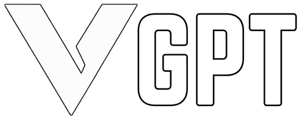
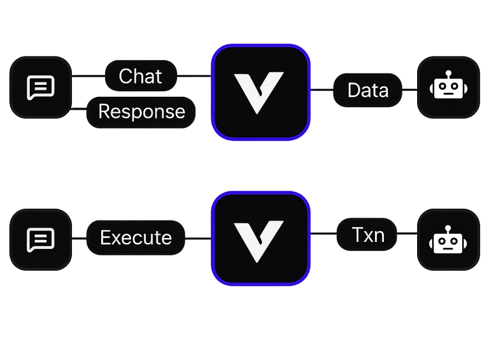

# VGPT Web Interface

<figure><figcaption></figcaption></figure>

## Overview

The **VGPT Web Interface** is the central LLM "HEART" of Vector AI - a comprehensive web application that showcases our backend LLM reasoning model. This reasoning model powers our Telegram bots, trading engines, and blockchain intelligence systems through natural language conversations.\
\
VGPT Web Chatbot: [https://chat.vector-ai.pro/](https://chat.vector-ai.pro/)

***

## Core Architecture

### Central LLM Engine

* **GPT-Powered Brain**: Advanced language model fine-tuned for blockchain intelligence
* **Multi-Modal Processing**: Handles contracts, social data, and market metrics simultaneously
* **Context Awareness**: Remembers conversation history and user preferences
* **Intent Classification**: Automatically determines if you need analysis, trading, or information

<figure><figcaption></figcaption></figure>

## 🏗️ System Components

<strong>🖥️ Web Interface</strong>

**Core Features:**

* Conversational chat interface with VGPT
* Real-time dashboards and interactive charts
* Multi-tab research sessions
* Mobile responsive design

**Advanced Tools:**

* Voice commands and speech-to-text
* Custom workspaces and themes
* Performance analytics and alerts

<strong>⚙️ Processing Engine</strong>

**Data Pipeline:**

* Parallel processing from multiple sources
* Real-time blockchain node connections
* Social media API integration (Twitter, Telegram, Discord)
* Web crawling and news aggregation

**Intelligence Modules:**

* Natural language understanding
* Pattern recognition and anomaly detection
* Predictive analytics and automated reasoning

<strong>🔗 Integration Hub</strong>

**Trading Platforms:**

* DEX integration (Uniswap, SushiSwap, PancakeSwap)
* CEX API connections
* DeFi protocol interactions
* Cross-chain bridge support

**Developer Tools:**

* REST API and GraphQL access
* WebSocket real-time streams
* SDK libraries and documentation
* Webhook support for external apps

## 🚀 Key Capabilities

### **Smart Token Research**

* **Contract Analysis**: Automated security audits and function mapping
* **Social Validation**: Cross-platform verification and team background checks
* **Market Intelligence**: Technical analysis with 50+ indicators and whale tracking
* **Risk Scoring**: Comprehensive fraud detection and investment risk assessment

### **Automation Control Center**

* **Viper Auto Sniper**: Configure and monitor automated trading strategies
* **Telegram Bot Management**: Control Vector Scope, Scanner, and IQ bots
* **Portfolio Management**: AI-driven rebalancing and optimization
* **Custom Workflows**: Build complex automation with visual interface

### **Real-Time Intelligence**

* **Live Monitoring**: Continuous blockchain and social media tracking
* **Smart Alerts**: AI-powered notifications with priority filtering
* **Performance Analytics**: Comprehensive trading and research metrics
* **Community Insights**: Track engagement across multiple platforms

## 💡 Advanced Features

### **Enterprise Security**

* Multi-factor authentication and API key management
* Complete audit logging and role-based access
* Encrypted communications and secure wallet integration

### **Developer Integration**

* GraphQL API for flexible queries
* Sandbox environment for strategy testing
* Custom dashboard builder
* Comprehensive documentation portal

## 🎯 Access & Pricing

### **Free Tier**

* Basic token analysis and limited AI queries
* Standard market data access
* Community support

### **Premium Tier** (VECTOR Staking Required)

* Unlimited AI queries and advanced analysis
* Real-time whale tracking and automation
* Priority support and exclusive features

