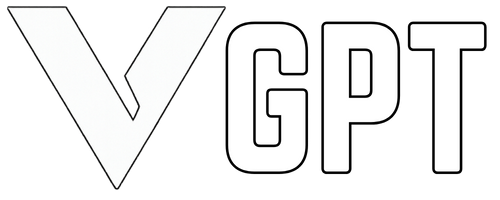
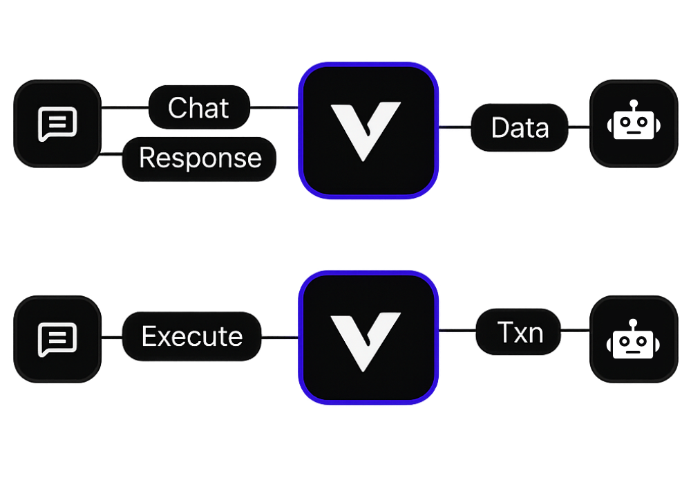

# VGPT Web Interface

<figure><figcaption></figcaption></figure>

## Overview

The **VGPT Web Interface** is the central LLM "HEART" of Vector AI - a comprehensive web application that showcases our backend LLM reasoning model. This reasoning model powers our Telegram bots, trading engines, and blockchain intelligence systems through natural language conversations.\
\
VGPT Web Chatbot: [https://chat.vector-ai.pro/](https://chat.vector-ai.pro/)

***

## Core Architecture

### Central LLM Engine

* **GPT-Powered Brain**: Advanced language model fine-tuned for blockchain intelligence
* **Multi-Modal Processing**: Handles contracts, social data, and market metrics simultaneously
* **Context Awareness**: Remembers conversation history and user preferences
* **Intent Classification**: Automatically determines if you need analysis, trading, or information

<figure><figcaption></figcaption></figure>

**VGPT in < 30 sec**

* **AI Engine** – Chat in any language, remembers context, auto-detects intent, fuses on- & off-chain data to spot trends, risks, and alpha.
* **Token Scanner** – Audits contracts (vulns, proxies, gas), cross-checks socials, tracks whales/liquidity/volume, 50+ TA indicators.
* **Data Feed** – Live multi-chain mempool + history, socials, news, price/volume/liquidity streams.
* **Risk Guard** – Honeypot & rug flags, clone detection, explainable dynamic risk score with user-set thresholds.
* **Automation** – One-click snipes, auto-rebalance/stop-loss, if-then workflows, smart alerts (email/SMS/TG/Discord/webhooks).
* **Dev & Integrations** – REST / GraphQL / WS APIs, SDKs, Telegram & Discord bots, responsive web/mobile app.
* **Analytics** – Portfolio & P/L dashboards, tax reports, sector & trend intel, exportable charts.
* **Tiers** – Free basics → Premium (stake VECTOR) → Enterprise & Dev (custom & high-rate API).

