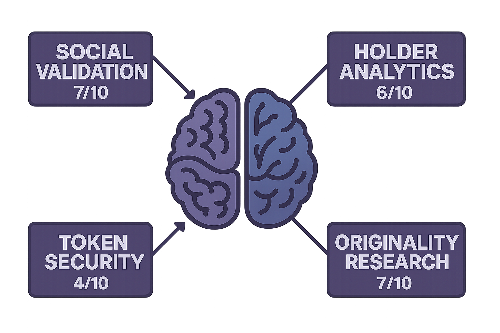

# vGPT Conversational Execution

## Overview

The vGPT Conversational Execution engine is the core component that enables natural language interaction with blockchain intelligence. It processes user queries, maintains context, and delivers comprehensive responses through an intuitive conversational interface.

<figure><figcaption><p>vGPT Conversational AI Processing</p></figcaption></figure>

## 🧠 Conversational AI Architecture

### **Natural Language Understanding (NLU)**
- **Intent Recognition**: Identifies user goals and required actions
- **Entity Extraction**: Extracts relevant information (addresses, tokens, amounts)
- **Context Preservation**: Maintains conversation history and user preferences
- **Ambiguity Resolution**: Clarifies unclear requests through follow-up questions

### **Dialogue Management**
- **State Tracking**: Monitors conversation flow and current context
- **Response Planning**: Determines optimal response structure and content
- **Multi-Turn Handling**: Manages complex conversations across multiple exchanges
- **Personalization**: Adapts responses based on user history and preferences

### **Response Generation**
- **Dynamic Content**: Generates contextually relevant responses
- **Multi-Modal Output**: Combines text, charts, and interactive elements
- **Structured Formatting**: Presents information in easily digestible formats
- **Action Suggestions**: Provides specific recommendations and next steps

## 🔄 Execution Flow

### **1. Query Processing**
```
User Input → Intent Analysis → Entity Extraction → Context Loading
```

**Process Steps:**
- Parse natural language input
- Identify query type (analysis, transaction, information)
- Extract relevant entities (contracts, wallets, tokens)
- Load conversation context and user preferences

### **2. Data Orchestration**
```
Query Analysis → Resource Planning → Parallel Execution → Data Aggregation
```

**Execution Strategy:**
- Determine required data sources and APIs
- Plan optimal execution sequence
- Execute multiple data requests in parallel
- Aggregate and validate collected information

### **3. AI Analysis**
```
Raw Data → Model Selection → Processing → Insight Generation
```

**Analysis Pipeline:**
- Select appropriate AI models for data type
- Process information through specialized models
- Generate insights and identify patterns
- Assess risks and opportunities

### **4. Response Synthesis**
```
Analysis Results → Response Planning → Content Generation → Delivery
```

**Response Creation:**
- Structure findings into coherent response
- Generate visualizations and charts
- Format for optimal readability
- Deliver through appropriate channel

## 💬 Conversation Management

### **Context Awareness**
- **Session Memory**: Remembers conversation history within sessions
- **User Profiles**: Maintains long-term user preferences and history
- **Cross-Platform Sync**: Synchronizes context across web and Telegram
- **Smart Defaults**: Uses context to pre-fill common parameters

### **Multi-Turn Conversations**
```
User: "Analyze PEPE token"
vGPT: [Provides comprehensive analysis]
User: "What about its liquidity?"
vGPT: [Focuses on liquidity metrics from previous analysis]
User: "Compare it to SHIB"
vGPT: [Comparative analysis using both tokens]
```

### **Follow-Up Handling**
- **Reference Resolution**: Understands pronouns and references
- **Topic Continuation**: Maintains focus on current analysis subject
- **Context Switching**: Smoothly transitions between different topics
- **Clarification Requests**: Asks for clarification when needed

## 🎯 Query Types & Responses

### **Token Analysis Queries**
**Input**: `"Analyze 0x1234...abcd"`
**Processing**:
1. Contract address validation
2. Multi-source data gathering
3. Security and risk assessment
4. Social validation analysis
5. Market intelligence compilation

**Output Structure**:
- Executive summary with risk score
- Security analysis and red flags
- Social validation results
- Market data and metrics
- Recommendations and next steps

### **Wallet Tracking Queries**
**Input**: `"What is this whale buying: 0x5678...efgh"`
**Processing**:
1. Wallet activity analysis
2. Recent transaction parsing
3. Token identification and analysis
4. Pattern recognition
5. Impact assessment

**Output Structure**:
- Wallet overview and classification
- Recent activity summary
- Token purchases and sales
- Market impact analysis
- Copy trading opportunities

### **Market Intelligence Queries**
**Input**: `"What's driving ETH price today?"`
**Processing**:
1. Price movement analysis
2. News and event correlation
3. Social sentiment assessment
4. Technical indicator analysis
5. Market factor identification

**Output Structure**:
- Price movement summary
- Key driving factors
- News and event impact
- Technical analysis insights
- Market outlook and predictions

## 🔧 Technical Implementation

### **Language Model Integration**
- **Primary LLM**: Advanced GPT model fine-tuned for crypto analysis
- **Specialized Models**: Domain-specific models for different analysis types
- **Model Routing**: Intelligent selection of appropriate models
- **Performance Optimization**: Caching and pre-computation for speed

### **Real-Time Processing**
- **Streaming Responses**: Progressive response delivery for long analyses
- **Parallel Processing**: Concurrent execution of multiple analysis tasks
- **Caching Strategy**: Intelligent caching of frequently requested data
- **Load Balancing**: Distribution of processing across multiple instances

### **Error Handling**
- **Graceful Degradation**: Fallback responses when data is unavailable
- **Retry Logic**: Automatic retry for failed API calls
- **User Feedback**: Clear error messages and suggested alternatives
- **Recovery Mechanisms**: Automatic recovery from temporary failures

## 📊 Performance Metrics

### **Response Quality**
- **Accuracy**: Correctness of analysis and predictions
- **Completeness**: Coverage of relevant information
- **Relevance**: Alignment with user intent and needs
- **Actionability**: Usefulness of recommendations and insights

### **User Experience**
- **Response Time**: Average time to deliver complete responses
- **Conversation Flow**: Smoothness of multi-turn interactions
- **Context Retention**: Accuracy of context preservation
- **User Satisfaction**: Feedback scores and engagement metrics

### **System Performance**
- **Throughput**: Number of queries processed per second
- **Availability**: System uptime and reliability
- **Scalability**: Performance under varying load conditions
- **Resource Efficiency**: Optimal use of computational resources

The vGPT Conversational Execution engine represents the cutting edge of AI-powered blockchain intelligence, delivering human-like understanding and expert-level analysis through natural conversation. 
