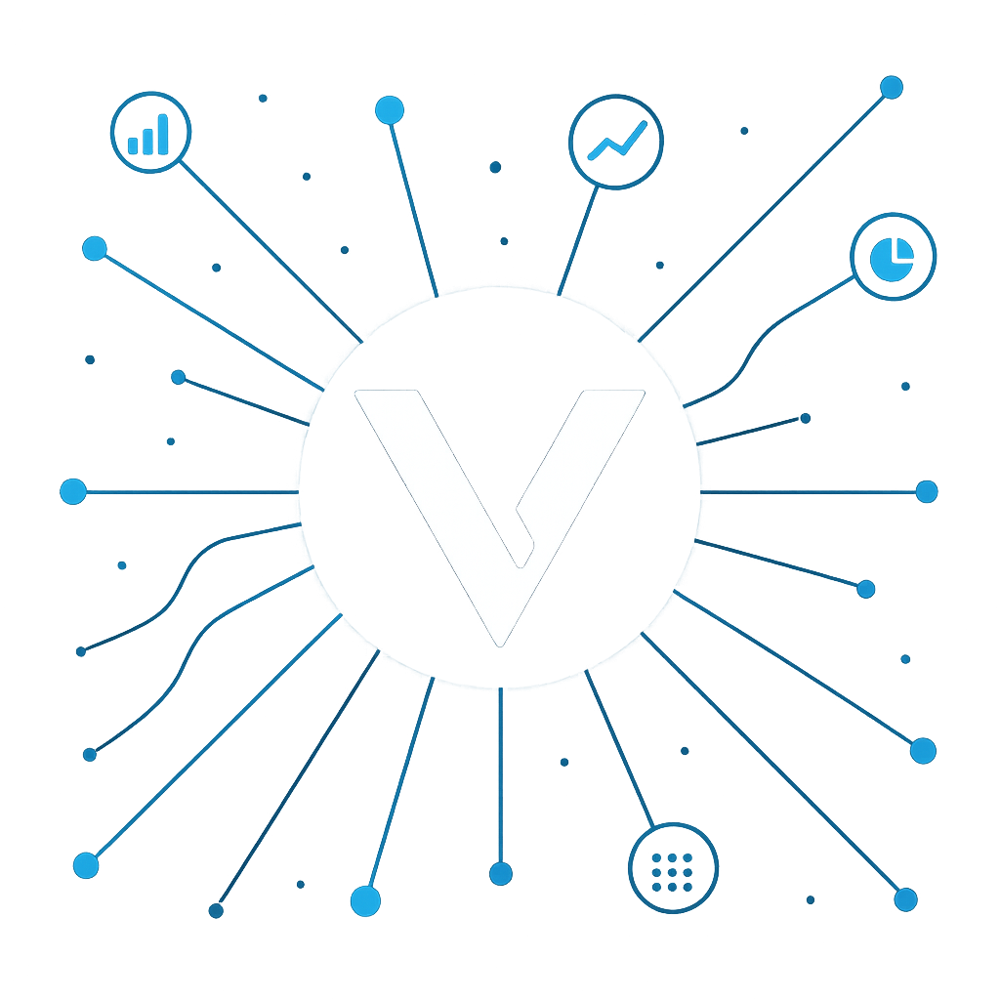

# How It Works

## VGPT Framework Overview

Vector GPT utilizes a sophisticated multi-layer architecture that combines blockchain connectivity, AI processing, and real-time data aggregation to deliver comprehensive intelligence and automation capabilities.

_An example framework of how Vector AI utilizes multiple sources to gather accurate data_

## Process Flow

### 1. Input Processing

* **User Commands**: Natural language input via web interface or Telegram
* **Request Classification**: AI determines request type (transaction, analysis, or information)
* **Intent Recognition**: System identifies specific actions and data requirements

### 2. Multi-Source Data Gathering

#### On-Chain Data Collection

* **Blockchain Scanning**: Real-time monitoring of multiple blockchain networks
* **Transaction Analysis**: Deep analysis of wallet activities, contract interactions
* **Smart Contract Parsing**: Automated contract code analysis and function mapping

#### Off-Chain Intelligence

* **Website Crawling**: Automated scanning of project websites and documentation
* **Social Media Integration**: Twitter, Telegram, and Discord data aggregation
* **News & Media**: Real-time news feed analysis and sentiment tracking
* **WHOIS Validation**: Domain verification and ownership tracking

### 3. AI Processing & Analysis

#### GPT-Powered Reasoning

* **Data Synthesis**: Combining multiple data sources for comprehensive analysis
* **Pattern Recognition**: AI identification of trends, anomalies, and opportunities
* **Risk Assessment**: Automated evaluation of investment and security risks
* **Sentiment Analysis**: Social media and news sentiment scoring

#### Specialized Analysis Modules

* **Whale Tracking**: Large wallet movement detection and analysis
* **Sniper Detection**: High-frequency trading pattern identification
* **Contract Security**: Smart contract vulnerability and risk assessment
* **Market Intelligence**: Price movement prediction and trend analysis

### 4. Output Generation

#### Information Delivery

* **Structured Reports**: Comprehensive analysis summaries
* **Real-time Alerts**: Instant notifications for significant events
* **Visual Data**: Charts, graphs, and interactive visualizations
* **Social Score Calculation**: Comprehensive project credibility scoring

#### Transaction Execution

* **Smart Contract Interaction**: Direct blockchain transaction capabilities
* **DeFi Protocol Integration**: Automated interactions with popular DeFi platforms
* **Portfolio Management**: Automated buying, selling, and rebalancing
* **Risk Management**: Automated stop-losses and position sizing

## Technical Architecture

### Data Layer

* **Blockchain Nodes**: Direct connections to major blockchain networks
* **API Integrations**: Real-time feeds from exchanges and data providers
* **Social APIs**: Integration with Twitter, Telegram, and Discord APIs
* **Web Scraping**: Automated content extraction and analysis

### Processing Layer

* **AI Engine**: Advanced language models for natural language processing
* **Analytics Engine**: Custom algorithms for blockchain and market analysis
* **Security Module**: Multi-layered security and risk management systems
* **Automation Engine**: Smart contract and DeFi protocol interaction capabilities

### Interface Layer

* **Web Application**: Full-featured web interface for comprehensive access
* **Telegram Bot**: Community-focused bot with social features
* **API Gateway**: Developer access for custom integrations
* **Mobile Optimization**: Responsive design for mobile access

## Key Differentiators

### Real-Time Intelligence

* **Live Data Processing**: Continuous monitoring and analysis of blockchain activities
* **Instant Notifications**: Real-time alerts for market opportunities and risks
* **Dynamic Adaptation**: AI models that learn and adapt to market conditions

### Natural Language Interface

* **Conversational AI**: Interact with complex blockchain data through simple conversations
* **Context Awareness**: AI remembers conversation history and user preferences
* **Multi-Language Support**: Comprehensive language support for global users

### Comprehensive Coverage

* **Multi-Chain Analysis**: Support for Ethereum, BSC, Polygon, and other major networks
* **Cross-Platform Integration**: Unified data from multiple sources and platforms
* **End-to-End Automation**: From analysis to execution in a single workflow
