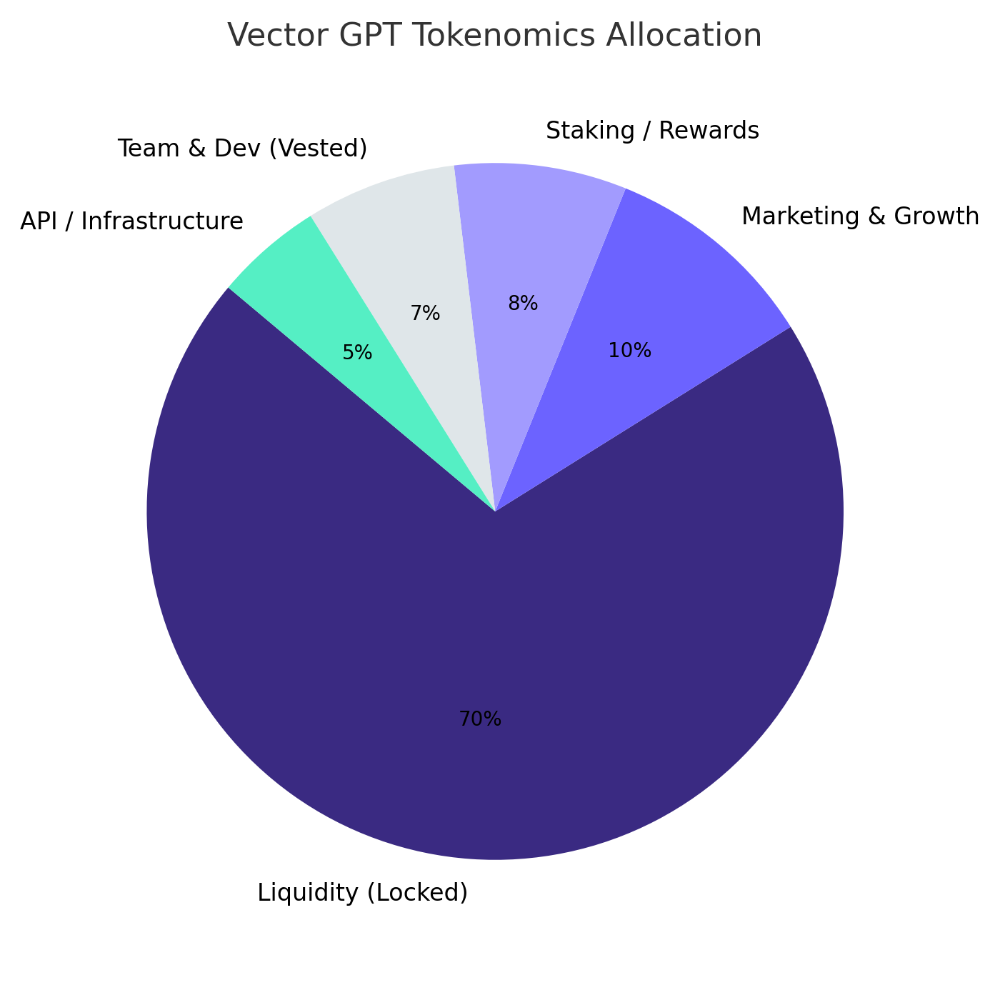

# Tokenomics

**Token Name**: Vector AI

**Symbol**: VECTOR

**Contract Address**: `0x569Dd3298E114Da858415ee5672C8F2AB57938Bf`

**Max Supply**: 1,000,000,000 VECTOR

***

<figure><figcaption>
VECTOR Token Distribution &#x26; Allocation Breakdown
</figcaption></figure>

| Category                 | Allocation | Tokens      | Purpose                                                  |
| ------------------------ | ---------- | ----------- | -------------------------------------------------------- |
| **Liquidity Pool**       | 70%        | 700,000,000 | Locked 12 months                                         |
| **Marketing & Growth**   | 10%        | 100,000,000 | User acquisition, partnerships (Cliff Vested)            |
| **Staking Rewards**      | 8%         | 80,000,000  | Reward distribution pool (Locked before Staking is Live) |
| **Team & Development**   | 7%         | 70,000,000  | Vested over 12 months                                    |
| **API & Infrastructure** | 5%         | 50,000,000  | Platform operations                                      |

***

## Security & Transparency

### Verified Locks & Vesting

* **70% liquidity locked for 12+ months** via [UNICRYPT](https://app.uncx.network/lockers/univ2/chain/1/address/0x0a52a68f468719c8ab0bb1c083040c051480680e/lock/0x663a5c229c09b049e36dcc11a9b0d4a8eb9db2140x0a52a68f468719c8ab0bb1c083040c051480680e0)
* **Team tokens vested with 3-month cliff + 18-month linear release** via [UNICRYPT](https://app.uncx.network/lockers/token/chain/1/address/0x569dd3298e114da858415ee5672c8f2ab57938bf)
* **5% balanced buy/sell tax structure**

### Vesting Schedule

* **Team Tokens (7%)**: Vested over 12 months ([Verified on UNICRYPT](https://app.uncx.network/lockers/token/chain/1/address/0x569dd3298e114da858415ee5672c8f2ab57938bf))
* **Marketing & Growth (10%)**: Cliff vested for user acquisition and partnerships
* **Staking Rewards (8%)**: Locked before staking platform goes live
* **Liquidity Pool (70%)**: Locked for 12+ months
* **API & Infrastructure (5%)**: Platform operations funding

***

## Tax Structure

### Trading Taxes

* **Buy Tax**: 5% (balanced across different functions)
* **Sell Tax**: 5% (balanced across different functions)

### Tax Distribution

* **Development Fund**: 3% (platform development and maintenance)
* **Marketing & Growth**: 1.5% (community building and marketing initiatives)
* **Buyback & Burn**: 0.5% (deflationary mechanism)\
  <mark style="color:orange;">May change as our platform evolves based on necessities<mark style="color:orange;">

***

## Utility & Use Cases

### 🔐 Access & Utility via Staking

**Stake-to-Access:**\
Unlock premium VGPT features by staking $VECTOR — from smart contract analysis to real-time AI research and Telegram tooling.

**Tiered Access Levels:**\
Different staking thresholds unlock progressively more powerful tools, API endpoints, and automation capabilities.

**Earning Through Usage:**\
Users who stake and actively use the platform can earn additional $VECTOR rewards, driving both engagement and sustainability.

***

### 💰 VECTOR-Powered Platform Economy

**Pay-per-Use (Microtransactions):**\
Certain advanced features and API calls require small $VECTOR payments — no subscription, just on-demand utility.

**Telegram Bot Payments & Tips:**\
Send tips or pay for services within Telegram using $VECTOR, creating a seamless chat-to-utility loop.

**Bounties & Referrals:**\
Earn $VECTOR through contribution-based bounties, community challenges, and successful referral programs.

***

### 🏛️ Governance & Protocol Ownership

**Community Voting:**\
Holders help shape the future of VGPT — vote on new feature integrations, research focus areas, and strategic decisions.

**Economic Control:**\
Vote on key parameters like staking rewards, fee tiers, and access pricing models.

**Treasury Oversight:**\
Participate in decisions around treasury fund allocation, protocol development grants, and community incentives.

