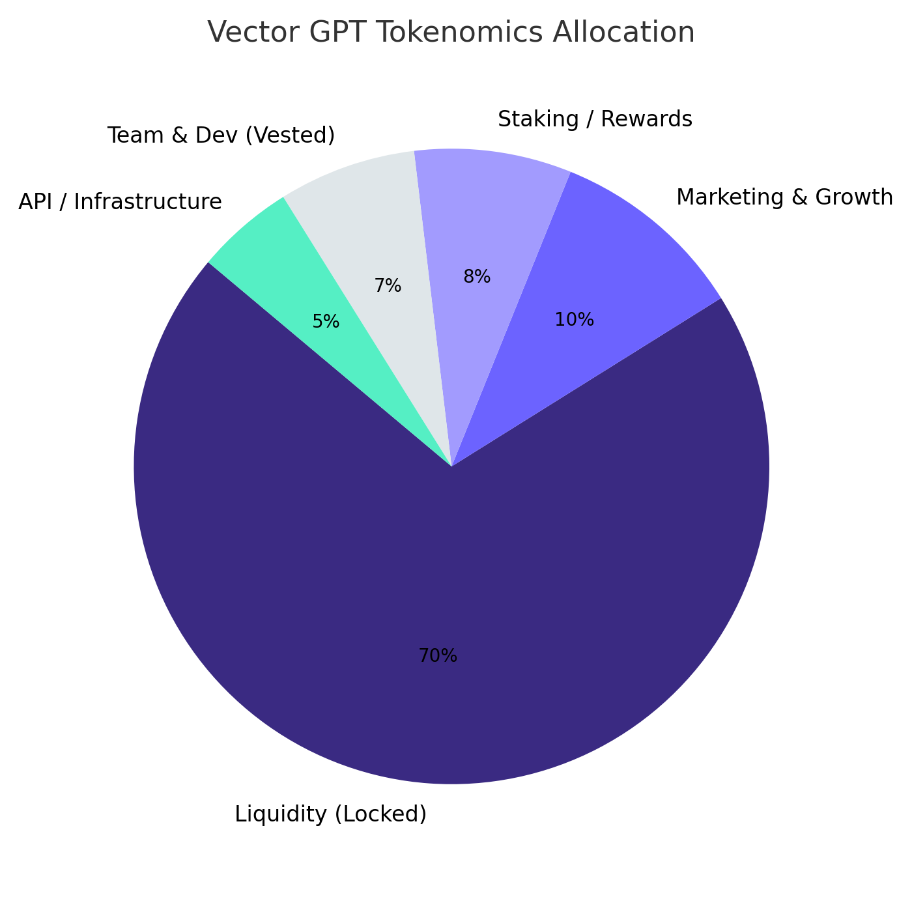

# VECTOR Token

**Token Name**: Vector AI

**Symbol**: VECTOR

**Contract Address**: `0x569Dd3298E114Da858415ee5672C8F2AB57938Bf`

**Max Supply**: 1,000,000,000 VECTOR

***

<figure><figcaption>
VECTOR Token Distribution &#x26; Allocation Breakdown
</figcaption></figure>

***

### Tokenomics & Revenue Model Overview

| Parameter               | Value                  | Notes                                                                                                               |
| ----------------------- | ---------------------- | ------------------------------------------------------------------------------------------------------------------- |
| **Ticker**              | `VECTOR`               | Utility & governance token for the whole Vector AI stack                                                            |
| **Current Tax**         | **5 % buy / 5 % sell** | Auto-swap-back routes the ETH to treasury – we treat this as **volatile “bonus fuel”** rather than core revenue     |
| **Core Utility**        | **Stake VECTOR**       | 
‣ Unlock premium features ‣ Fee rebates on Viper trades ‣ Future governance &#x26; revenue-share votes
 |
| **Monetization Status** | **R\&D Mode**          | Focus is on **accuracy + UX polish**; pay-walls flip on once heuristics are 🔒-tight                                |

***
