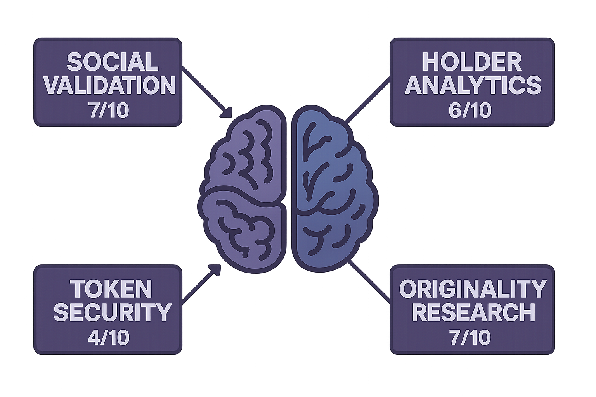
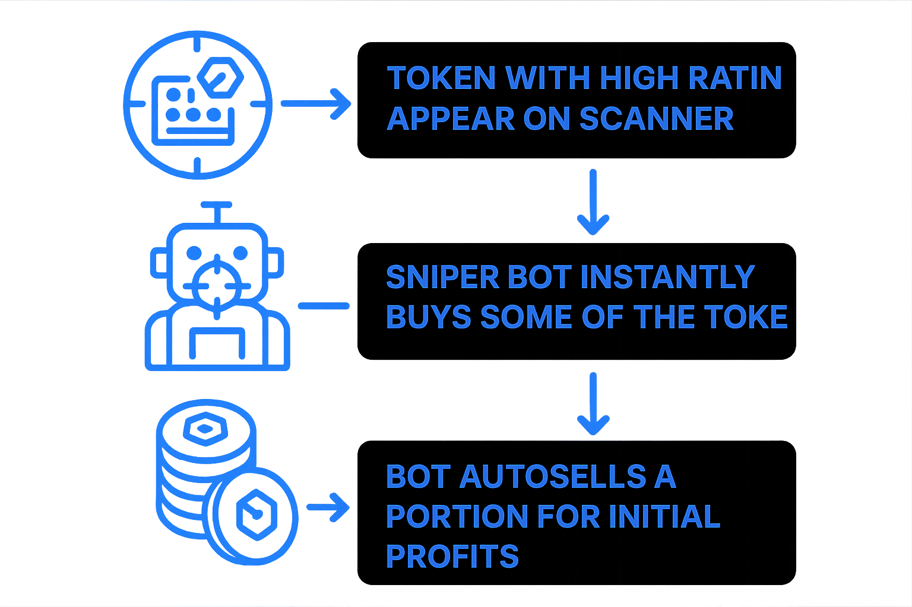
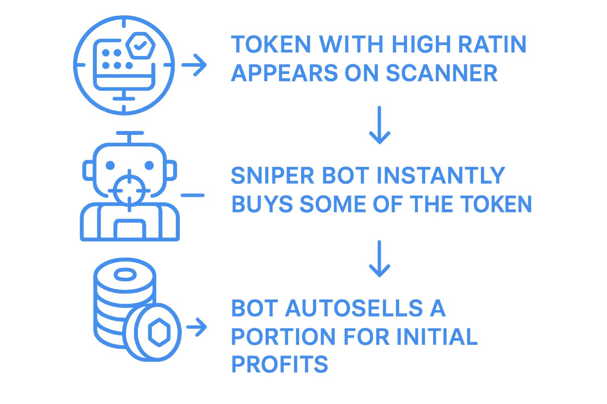

# 🎯 VGPT Use Cases

Vector AI offers advanced tooling for evaluating token legitimacy, automating due diligence, and surfacing on-chain intelligence through natural language and AI reasoning via VGPT.

---

## 🧠 Multi-Pipeline Token Scanning

<figure><figcaption>
Comprehensive token evaluation across multiple data sources
</figcaption></figure>

Automatically evaluate the credibility of new tokens by scanning Twitter, Telegram, and other off-chain platforms as well as token security, holder information and honeypot checks.

**Key Features:**
- Cross-platform social media analysis
- Smart contract security audits
- Holder distribution analysis
- Honeypot and rug pull detection
- Real-time risk assessment

---

## 💬 Ask VGPT About a Scan

<figure><figcaption>
AI-powered reasoning and analysis capabilities
</figcaption></figure>

Want deeper insights? Once a token is scanned, you can **ask VGPT follow-up questions** like:

- "Is this team linked to any past scams?"
- "Summarize the project based on their docs and site."
- "Does the Twitter match the contract?"
- "What's suspicious about this token?"
- "Rate this project's legitimacy from 1–10."

🧠 **VGPT connects the dots** across contract code, websites, socials, and documentation — giving you human-like reasoning in seconds.

---

## 🔗 Deep Link Ecosystem Analysis

Extract and verify all links from token websites, documentation, and social profiles. Detect inconsistencies, reused templates, and mismatched identities that signal scams or impersonators.

**Analysis Capabilities:**
- Website and documentation link verification
- Social profile cross-referencing
- Template and content originality detection
- Team bio and claim verification
- Identity mismatch flagging

VGPT cross-references team bios, project claims, and social engagement to flag red flags or verify authenticity.

---

## 🧬 Cross-Signal Token Scoring

<figure><figcaption>
Comprehensive token scoring across multiple signals
</figcaption></figure>

Assign comprehensive scores to tokens using multiple data sources:

### **On-Chain Metrics**
- Contract security analysis
- Liquidity depth and stability
- Holder distribution patterns
- Transaction volume and velocity

### **Off-Chain Intelligence**
- Social media engagement quality
- Community sentiment analysis
- News and media coverage
- Influencer mentions and impact

### **Technical Validation**
- WHOIS domain records verification
- Website content analysis
- Documentation quality assessment
- Development activity tracking

---

## 📄 Documentation & Site Intelligence

Scrape and summarize project information from multiple sources:

**Content Analysis:**
- Project websites and landing pages
- GitBooks and technical documentation
- Whitepapers and tokenomics documents
- Social media profiles and posts

**Quality Assessment:**
- Originality and effort evaluation
- Consistency across platforms
- Low-effort fork and clone identification
- Content depth and technical accuracy

---

## 🔁 Automated Contract Matching

Match smart contracts to all linked project assets with comprehensive verification:

**Verification Process:**
- Contract mention verification on official sites
- Social media contract references
- Documentation consistency checks
- Fake or unlinked token identification

**Cross-Platform Validation:**
- Website-to-contract matching
- Social profile verification
- Team wallet connections
- Official announcement validation

---

## ⚡ Real-Time Onboarding Surveillance

<figure><figcaption>
Automated real-time token deployment monitoring
</figcaption></figure>

Monitor new deployments on-chain and immediately trigger comprehensive validation:

**Instant Analysis:**
- New contract deployment detection
- Immediate ecosystem connection validation
- Original development effort assessment
- Social presence verification in seconds

**Competitive Advantage:**
- First-to-market intelligence
- Pre-trend identification
- Early risk detection
- Automated opportunity alerts

---

## 🎯 Link Discovery & Validation

All analysis components are combined via **VGPT-powered reasoning** for transparent and explainable legitimacy scoring:

**Comprehensive Validation:**
- Multi-source data correlation
- AI-powered pattern recognition
- Transparent scoring methodology
- Explainable risk assessment

**Real-Time Intelligence:**
- Continuous monitoring and updates
- Dynamic risk score adjustments
- Alert system for significant changes
- Historical trend analysis

The VGPT Use Cases demonstrate how Vector AI transforms complex blockchain analysis into simple, conversational intelligence that anyone can understand and act upon. 
